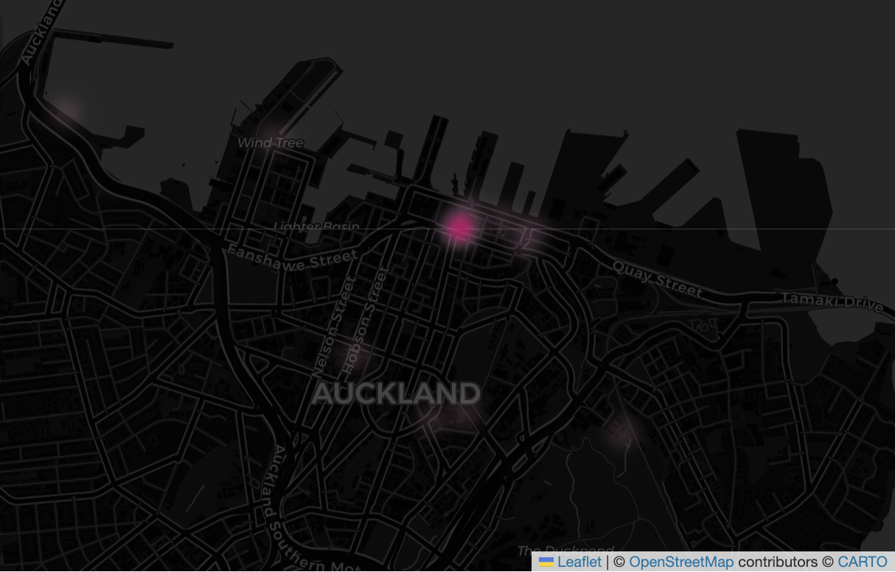
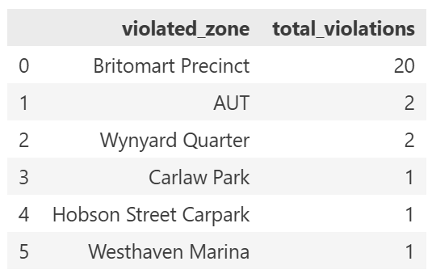

This Python package is used for analysing Flamingo e-scooter movement patterns within the Auckland CBD, providing tools to clean trip data and easily identify trips ending in restricted no-parking zones. It is designed to assist Auckland Council, Auckland Transport, and Flamingo Scooters to better understand scooter usage, support infrastructure planning, and improve enforcement of parking restrictions.

## Features:
- Loads and cleans Flamingo trip data
- Generate OD flows between SA zones
- Detect rides ending in no-parking zones
- Create interactive folium maps to visualise common routes and parking violation areas
- Analyse how many users may be using the scooters to connect to public transport

## Installation
In terminal: 
```bash
uv pip install flamingo-escooter 
```

Alternatively:
```bash
pip install uv
git clone https://github.com/jhe482-uoa/flamingo-escooter
cd flamingo-escooter
uv sync
uv build # Optional
```

## Demonstration of usage

```python 
import flamingo_escooter as fe

# ── 1. load data ─────────────────────────────────────────────────────────────
trips   = fe.load_trips()
zones   = fe.load_sa_cached()
transit = fe.load_transit_stations()
geofence = fe.load_geofence()

# ── 2. origin-destination flows ───────────────────────────────────────────────
od = fe.od_flows(trips, zones)
print(od.head())

# ── 3. geofence violations ────────────────────────────────────────────────────
violations = fe.geofence_violations(trips, geofence)
print(fe.violations_table_wide(violations))

# ── 4. transit proximity ──────────────────────────────────────────────────────
# how many trips started/ended within 20m of a transit station?
trips_transit = fe.transit_proximity(od, transit, 20)

# ── 5. visualise ──────────────────────────────────────────────────────────────
fe.path_heatmap(trips)             # where do scooters go?
fe.violation_heatmap(violations)   # where are rules broken?
fe.transit_heatmap(trips_transit)  # first/last mile patterns based on 20m proximity
```

See demo.ipynb for an additional demo file.

## Example Outputs using demo data

### Path Heatmap


### Violation Heatmap



### Violation table in wide format



### First and Last Mile Heatmap


## Functions

### Data Loading
- `load_trips()` - Load and clean Flamingo scooter trip data, converts it into a spatial GeoDataFrame.
- `load_sa()` - Download Stats NZ SA1 boundaries 
- `load_sa_cached()` - Load SA1 boundaries from a local cache to avoid repeated API requests
- `load_geofence()` - Load Flamingo geofence zones and converts them into a GeoDataFrame.
- `load_transit_stations` - Loads Auckland bus and train station locations into one combined transit GeoDataFrame

### Analysis
- `od_flows()` - Assigns scooter trip start and end points to statistical areas define by SA1 to create origin-destination flow data
- `geofence_violations()` - Identifies scooter trips that end inside restricted no-parking geofenced zones.
- `violations_table_wide()` - Summarieses geofence violations by zones in a table.
- `transit_proximity()` - Calculates how many scooter trips start or end within 20 m of a public transport station.

### Visualisation
- `path_heatmap()` - Creates an interactive heatmap showing most concentrated scooter paths through the CBD.
- `violation_heatmap()` - Creates an interactive heatmap showing where no-parking violations are most concentrated.
- `first_and_last_mile_heatmap()` - Creates an interactive heatmap showing concentrated areas where scooter trips start or end near public transport stations.

## Authors add emails

- Jeff He - jhe482@aucklanduni.ac.nz
- Georgia Short - gsho521@aucklanduni.ac.nz
- Hans Setiawan - hset686@aucklanduni.ac.nz

## Supervisor
- Hyesop Shin - hyesop.shin@auckland.ac.nz

## Industry Partner

- Flamingo Scooters