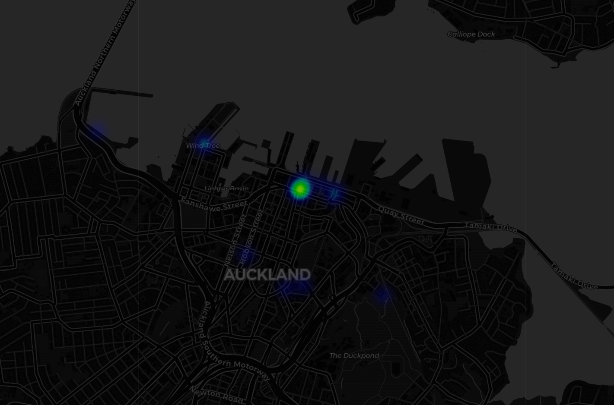

# flamingo-escooter
This repo contains the code for the Python package "flamingo-escooter" - a package focusing on analysing movement patterns within the Auckland CBD, providing tools to clean trip data, easily identify trips ending in restricted no-parking zones, and perform other analysis. It is currently designed to work with Flamingo Scooters dataset only.

It is designed to assist Auckland Council, Auckland Transport, and Flamingo Scooters to better understand scooter usage, support infrastructure planning, and improve enforcement of parking restrictions.

## Features:
- Loads and cleans Flamingo trip data
- Geenrate OD flows between SA zones
- Detect rides ending in no-parking zones
- Create interactive Folium maps to visualise common routes and parking violation areas
- Analyse how many users may be using the scooters to connect to public transport

## Installation
In terminal: ```bash uv pip install flamingo-escooter ```

## Demonstration of usage
import flamingo_escooter as fe

# load bundled Flamingo trip CSV → GeoDataFrame (EPSG:2193)
trips = fe.load_trips()

# fetch Stats NZ SA boundaries (cached after first run)
zones = fe.load_sa_cached()

# spatial join trips to zones → OD columns
od = fe.od_flows(trips, zones)

# fetch live Flamingo geofence zones from GBFS API
geofence = fe.geofence_json_to_gdf()

# find trips that ended inside a no-parking zone
violations = fe.geofence_violations(trips, geofence)

# render interactive Folium heatmap of violation hotspots
fe.violation_heatmap(violations)

## Example Outputs

### Path Heatmap


### Violation Heatmap



### Violation table in wide format


## Functions

### Data Loading
- load_trips()
- load_sa()
- geofence_json_to_gdf()

### Analysis
- od_flows()
- geofence_violations()
- violations_table_wide()
- transit_proximity()

### Visualisation
- path_heatmap()
- violation_heatmap()

## Authors

- Jeff He
- Georgia Short
- Hans Setiawan

## Supervisor
- Hyesop Shin

## Industry Partner

Flamingo Scooters