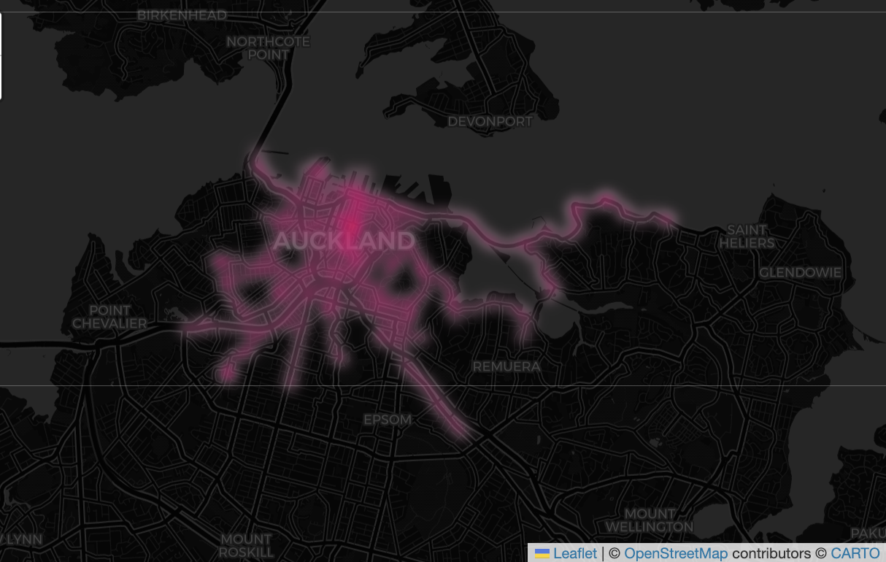
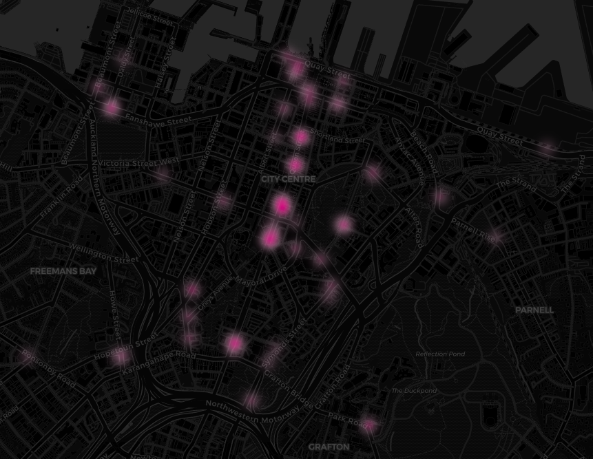

# Flamingo E-Scooter

Flamingo E-Scooter is a Python package for analysing Flamingo scooter movement patterns in the Auckland CBD. It is built to help transport planners, local authorities, and data analysts understand route flows, detect geofence and parking violations, and evaluate connections to public transport.

## What this package does

- Load, clean, and enrich Flamingo trip datasets.
- Decode encoded route polylines into spatial geometries.
- Compute origin-destination flows across Auckland statistical areas.
- Detect parking and geofence violations inside restricted zones.
- Measure transit proximity for first- and last-mile analysis.
- Generate interactive visualizations of routes and violation hotspots.

## Documentation pages

- [Getting Started](getting-started.qmd) — install the package and run the first analysis.
- [API Reference](api-reference.qmd) — complete function documentation.
- [Examples](examples.qmd) — practical workflows and code recipes.
- [Visualization Gallery](visualizations.qmd) — sample outputs and map guidance.

## Quick start

```python
from flamingo_escooter import analyse

trips = analyse()
print(trips[['origin', 'destination', 'is_violation']].head())
```

The `analyse()` function runs the full pipeline in one call: load trips, fetch SA boundary zones, compute OD flows, detect violations, and calculate transit proximity.

## Why use Flamingo E-Scooter?

- Works with Auckland CBD trip datasets and NZTM projection (EPSG:2193).
- Designed for rapid exploration of scooter behaviour and geofence compliance.
- Supports both raw CSV input and built-in demo data.
- Produces summary tables, violation metrics, and Folium map outputs.

## Included resources

- `demo.ipynb` — interactive notebook example.
- `src/flamingo_escooter/data/flamingo_trip_dataset_sample.csv` — bundled sample trip data.
- Gallery images and visual examples stored in `docs/`.

## Sample outputs





